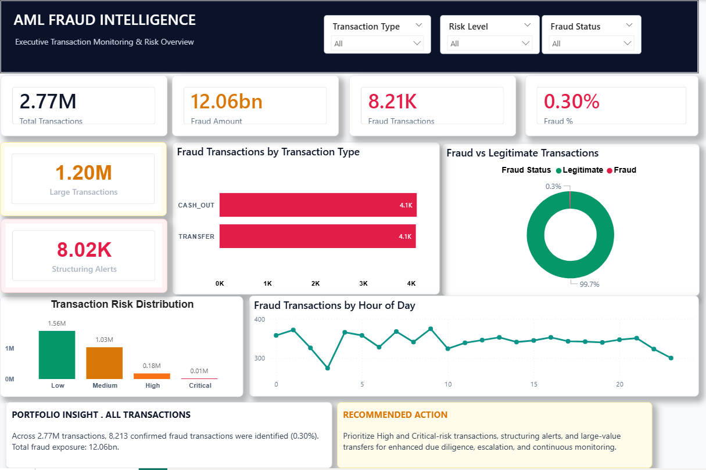
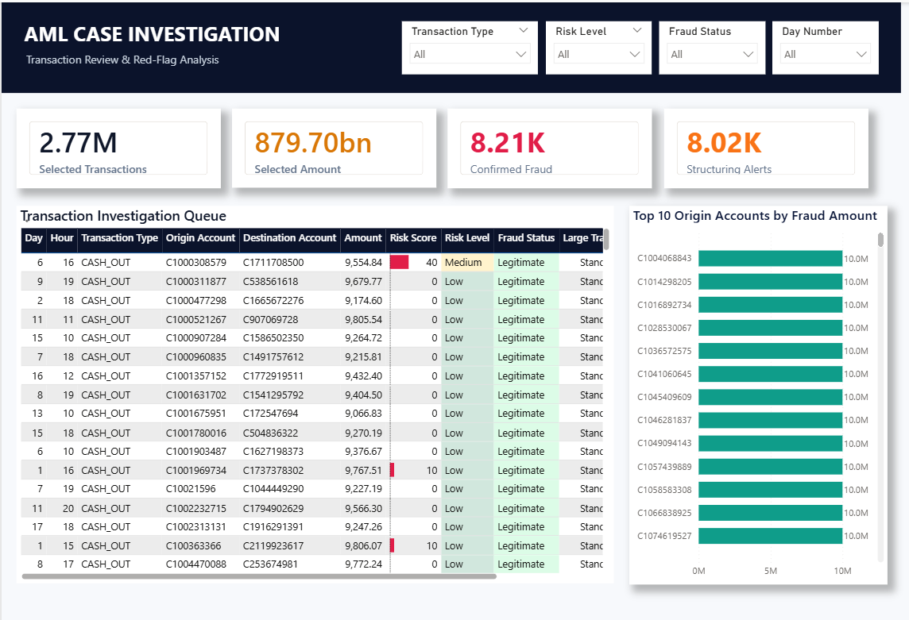

# AML Fraud Analytics & Transaction Monitoring

A project on turning a large, messy transaction population into something an investigation or fraud-monitoring team could actually work with — cleaned data, engineered risk signals, and an interactive Power BI dashboard on top.

I focused on **CASH_OUT** and **TRANSFER** transactions, since that's where confirmed fraud is concentrated in the source data. After cleaning and enrichment, the final analytical dataset lands at roughly 2.77 million transactions.

This repo holds the analytical pipeline, the fraud/risk logic behind it, dashboard screenshots, and the executive case-study presentation I put together to walk through the findings.

## Why this project

Manually reviewing millions of transactions isn't realistic for any team. I wanted to see how far you could get toward a workable prioritization layer using nothing more exotic than pandas, some domain-informed feature engineering, and Power BI — not fraud alone, but the *behavior* around it: accounts drained to zero right after a transaction, previously dormant destination accounts suddenly receiving funds, structuring-like patterns, and so on. These are treated as signals that something deserves a second look, not as a verdict.

## Highlights

- **2.77M** transactions in the analyzed population
- **8.21K** confirmed fraud cases (~0.30% of all transactions)
- **~$12.06B** in confirmed fraud exposure
- **~1.20M** large-value transactions flagged
- **~8.02K** structuring-related alerts

## Dashboards

**Executive Overview** — portfolio-level view: transaction volume, confirmed fraud, exposure, risk distribution, transaction type, and activity over time.



**Investigation Detail** — the same population filtered down to transaction- and account-level detail, built for moving from "what's the portfolio doing" to "which case do I open next."



## Key findings

Confirmed fraud is concentrated almost entirely in CASH_OUT and TRANSFER activity. It's a small share of transaction *volume* (~0.30%) but an outsized share of transaction *value* — which is the main argument for monitoring exposure, not just counting flagged transactions.

Large-value activity turns out to be common across the dataset generally, so amount alone isn't a strong enough signal on its own. Combining it with behavioral indicators (balance draining to zero, dormant accounts suddenly active, structuring patterns) gives a much more useful basis for prioritization than any single indicator would.

## How it works

```
Raw transaction data → extraction → cleaning & transformation → risk indicator
engineering → validation & EDA → Power BI dashboard → investigation & review
```

Each stage lives in its own script so it can be run and reviewed independently:

| Script | What it does |
|---|---|
| `extract.py` | Reads and inspects the source transaction data |
| `transform.py` | Cleans the data and builds the analysis population |
| `feature_engineering.py` | Builds the behavioral and risk indicators |
| `validation.py` | Checks the processed data and key fraud metrics |
| `eda.py` | Explores transaction and fraud patterns pre-dashboard |
| `run_pipeline.py` | Main entry point — runs the full pipeline end to end |

## Project structure

```
AML-Fraud-Transaction-Monitoring/
│
├── src/
│   ├── config.py
│   ├── extract.py
│   ├── transform.py
│   ├── feature_engineering.py
│   ├── validation.py
│   ├── load.py
│   ├── eda.py
│   └── utils.py
│
├── screenshots/
│   ├── executive_overview.png
│   └── investigation_detail.png
│
├── presentation/
│   └── AML_Fraud_Executive_Case_Study.pptx
│
├── run_pipeline.py
├── README.md
└── .gitignore
```

The raw and generated datasets aren't tracked in this repo — they're too large for version control.

## Getting started

```bash
# Clone the repo
git clone https://github.com/srinivassuresh975-afk/AML-Fraud-Transaction-Monitoring.git
cd AML-Fraud-Transaction-Monitoring

# Install dependencies
pip install pandas
```

> If your environment needs more than pandas (numpy, scikit-learn, matplotlib, etc.), it's worth freezing those into a `requirements.txt` — `pip install -r requirements.txt` is a much more reliable setup path for anyone else pulling this repo.

Drop your source transaction CSV into `data/raw/`, double-check the file path in `src/config.py`, then run:

```bash
python run_pipeline.py
```

Individual scripts under `src/` can also be run on their own if you're testing or reviewing one stage at a time.

## Notes & limitations

The risk indicators here are meant to support prioritization, not to serve as a verdict — in a real AML/fraud environment, any alert would still need customer context, transaction history, and an investigator's judgment before it's acted on. The `.pbix` file and full datasets aren't included in this repo due to size, but the pipeline, screenshots, and case-study deck are enough to review the approach end to end.

## What I'd add next

- Backtest the risk logic against a real historical (non-synthetic) sample
- Move the structuring/velocity checks from static thresholds to a rolling window
- Add a lightweight scoring calibration step instead of the current rule-based split

## License

This project is licensed under the MIT License — see [`LICENSE`](LICENSE) for details. *(Add a `LICENSE` file to the repo root if it isn't there yet — GitHub won't show a license badge without one.)*

## Contact

Srinivas Suresh — feel free to open an issue or reach out if you have questions about the approach.
