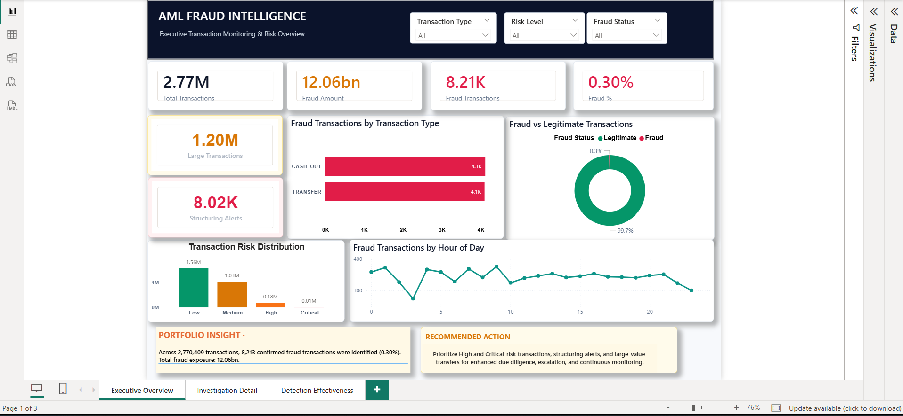
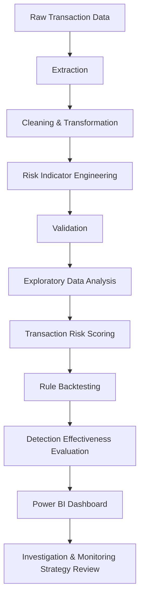
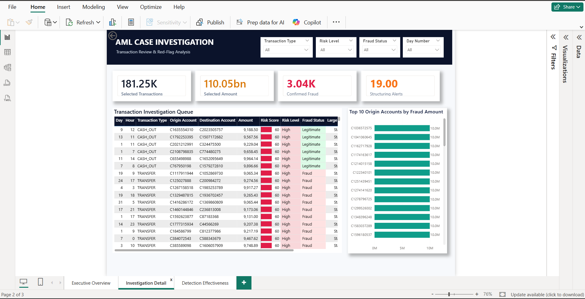
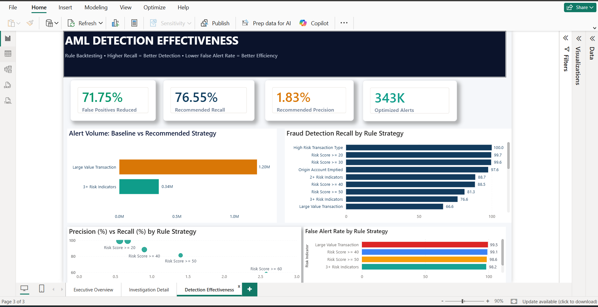

# AML Fraud Analytics & Transaction Monitoring

**Python · pandas · NumPy · Power BI · DAX · Rule Backtesting · Confusion-Matrix Analytics · Behavioral Risk Scoring**

> End-to-end AML/fraud analytics case study transforming 2.77M+ synthetic transactions into an investigation-ready analytical layer — combining Python-based risk engineering, monitoring-rule backtesting, and a 3-page Power BI dashboard.

📊 [Watch the Dashboard Walkthrough](https://www.youtube.com/watch?v=lp5EbN30bXc) · 💻 [GitHub Profile](https://github.com/srinivassuresh975-afk)

---

## Table of Contents

- [Project Snapshot](#project-snapshot)
- [Dashboard Walkthrough](#-dashboard-walkthrough)
- [Business Problem](#business-problem)
- [Data Source](#data-source)
- [Solution Architecture](#solution-architecture)
- [Power BI Dashboard](#power-bi-dashboard)
  - [1. Executive Overview](#1-executive-overview)
  - [2. Investigation Detail](#2-investigation-detail)
  - [3. Detection Effectiveness](#3-detection-effectiveness)
- [Detection Effectiveness Methodology](#detection-effectiveness-methodology)
- [Key Findings](#key-findings)
- [Risk Indicators](#risk-indicators)
- [Python Analytics Pipeline](#python-analytics-pipeline)
- [Repository Structure](#repository-structure)
- [Getting Started](#getting-started)
- [Analytical Outputs](#analytical-outputs)
- [Technology Stack](#technology-stack)
- [Limitations & Model Risk](#limitations--model-risk)
- [Future Improvements](#future-improvements)
- [What This Project Demonstrates](#what-this-project-demonstrates)
- [License](#license)
- [Contact](#contact)

---

## Project Snapshot

| KPI | Result |
|---|---:|
| Transactions Analyzed | **2.77M+** |
| Confirmed Fraud Cases | **8.21K** |
| Confirmed Fraud Exposure | **$12.06B** |
| False Positives Reduced — Recommended Strategy | **71.75%** |
| Recall — Recommended Strategy | **76.55%** |
| Precision — Recommended Strategy | **1.83%** |
| Optimized Alert Volume | **343K** |

> **Dataset note:** All figures above are derived from **PaySim**, a public synthetic mobile-money dataset. Dollar exposure and fraud counts are simulated, not real institutional data — see [Data Source](#data-source).

Precision (1.83%) remains low because confirmed fraud is rare and the recommended strategy prioritizes fraud coverage over aggressive alert suppression. The [Detection Effectiveness](#3-detection-effectiveness) analysis makes this trade-off explicit rather than presenting recall in isolation.

The project moves beyond descriptive fraud reporting by evaluating how monitoring strategies perform against confirmed fraud outcomes and quantifying the trade-off between **fraud detection and investigation workload**.

---

## Dashboard Walkthrough

 **[Watch the Full Power BI Dashboard Walkthrough on YouTube](https://www.youtube.com/watch?v=lp5EbN30bXc)**

The 3-page dashboard follows the transaction-monitoring workflow:

**Executive Overview → Investigation Detail → Detection Effectiveness**



---

## Business Problem

Transaction-monitoring teams must identify a relatively small number of genuinely high-risk transactions within millions of legitimate transactions.

The challenge is not simply detecting high-value activity. Monitoring teams must balance two competing objectives:

1. **Detect as much confirmed fraudulent activity as possible**
2. **Avoid overwhelming investigators with unnecessary alerts**

A monitoring rule that catches more fraud but generates an unmanageable number of false positives may not be operationally effective.

This project therefore combines two analytical layers:

- **Transaction Risk Analytics** — identifies and prioritizes suspicious activity for investigation.
- **Detection Effectiveness Analytics** — backtests monitoring strategies against confirmed fraud outcomes to measure recall, precision, false positives, and alert volume.

---

## Data Source

This project uses the **PaySim synthetic mobile-money transaction dataset**, a public dataset commonly used for fraud-detection research and portfolio projects.

The source contains transaction-level records with confirmed fraud labels (`isFraud`), allowing monitoring strategies to be evaluated against known outcomes.

### Analytical Population

- **Transactions analyzed:** approximately 2.77M+
- **Primary transaction types:** `CASH_OUT` and `TRANSFER`
- **Confirmed fraud cases:** approximately 8.21K
- **Confirmed fraud exposure:** approximately $12.06B
- **Data type:** Public synthetic transaction data
- **Use:** Portfolio / educational analytics project

> **No confidential institution, client, or real customer data is used in this project.**

---

## Solution Architecture



The workflow separates data preparation, behavioral-risk engineering, monitoring-rule evaluation, and visualization into reproducible analytical stages.

---

# Power BI Dashboard

The Power BI solution contains **three analytical pages**, each designed for a different stage of the transaction-monitoring workflow.

---

## 1. Executive Overview

The Executive Overview provides management with a portfolio-level view of transaction activity and fraud exposure before drilling into individual cases.

### Key Monitoring Areas

- Total transaction volume
- Confirmed fraud cases
- Confirmed fraud exposure
- Fraud percentage
- Large-value transactions
- Structuring alerts
- Fraud by transaction type
- Fraud vs legitimate activity
- Risk-level distribution
- Fraud activity by hour of day

### Business Question

> **Where is transaction-monitoring risk concentrated?**

---

## 2. Investigation Detail



The Investigation Detail page provides an analyst-facing investigation queue designed to prioritize suspicious transactions using multiple behavioral and transactional risk indicators.

The investigation queue is prioritized using **Risk Score**, helping analysts focus on higher-risk activity rather than reviewing transactions solely by monetary value.

### Investigation Signals

- Transaction type
- Transaction amount
- Risk level
- Risk score
- Fraud status
- Large-value indicators
- Origin-account behavior
- Destination-account behavior
- Balance inconsistencies
- Structuring-related signals
- Composite risk indicators

### Business Question

> **Which transactions should investigators review first?**

---

## 3. Detection Effectiveness



The Detection Effectiveness page backtests monitoring strategies against confirmed fraud outcomes.

Instead of assuming that more alerts automatically mean better monitoring, this page evaluates the relationship between:

- Fraud recall
- Precision
- False-alert rate
- False-positive reduction
- Total alert volume
- Monitoring-rule thresholds

### Recommended Strategy

| Metric | Result |
|---|---:|
| False Positives Reduced | **71.75%** |
| Recommended Recall | **76.55%** |
| Recommended Precision | **1.83%** |
| Optimized Alerts | **343K** |

The recommended strategy materially reduces unnecessary alerts while retaining a substantial proportion of detected fraud.

### Business Question

> **How much confirmed fraud can we detect while reducing unnecessary investigation workload?**

---

# Detection Effectiveness Methodology

Each monitoring strategy is backtested against the known `isFraud` outcome.

For every rule strategy, the analytical layer calculates:

- True Positives
- False Positives
- True Negatives
- False Negatives
- Recall
- Precision
- False Alert Rate
- Specificity
- F1 Score
- Total Alerts

### Recall

```text
Recall = True Positives / (True Positives + False Negatives)
```

Recall measures how much confirmed fraud is detected by the monitoring strategy.

**Higher recall = better fraud coverage.**

### Precision

```text
Precision = True Positives / (True Positives + False Positives)
```

Precision measures how targeted the generated alerts are.

**Higher precision = a greater proportion of alerts correspond to confirmed fraud.**

### False Alert Rate

False-alert analysis measures the operational burden created by alerts that do not correspond to confirmed fraud.

### False-Positive Reduction

False-positive reduction measures how much unnecessary alert volume can be eliminated compared with a broader monitoring baseline.

This is operationally important because excessive false positives consume investigator capacity and increase investigation workload.

---

# Key Findings

### 1. Fraud Is Highly Concentrated

Confirmed fraud is concentrated almost entirely within **CASH_OUT** and **TRANSFER** transactions in the analyzed population.

This supports focusing monitoring analysis on transaction types where confirmed fraud is actually observed.

### 2. Fraud Is Rare by Count but Significant by Exposure

Confirmed fraud represents only approximately **0.30%** of the analyzed transaction population, while the associated monetary exposure is substantial.

This demonstrates why transaction-monitoring programs should evaluate both transaction frequency and monetary exposure.

**Transaction count alone can understate financial risk.**

### 3. Transaction Value Alone Is Not Sufficient

Large-value transactions occur in both fraudulent and legitimate activity.

> **Large transaction ≠ automatically suspicious transaction**

Combining transaction value with behavioral indicators produces a stronger investigation-prioritization framework.

### 4. Behavioral Signals Improve Prioritization

Useful investigation signals include:

- Origin account emptied after the transaction
- Previously empty destination account receiving funds
- Balance inconsistencies
- Structuring-like behavior
- High-risk transaction types
- Multiple simultaneous risk indicators

### 5. Higher Alert Volume Does Not Automatically Mean Better Monitoring

A broad monitoring rule can achieve high fraud coverage while creating an excessive investigation burden.

The recommended strategy provides a more operationally balanced approach:

- **71.75% reduction in false positives**
- **76.55% recall**
- **1.83% precision**
- **343K optimized alerts**

This highlights the fundamental transaction-monitoring trade-off between **detection coverage and investigation capacity**.

---

# Risk Indicators

| Risk Indicator | Investigation Rationale |
|---|---|
| **High-risk transaction type** | Highlights CASH_OUT and TRANSFER activity where confirmed fraud is concentrated |
| **Large transaction** | Flags transactions exceeding the defined large-value threshold |
| **Very large transaction** | Identifies exceptionally high-value transactions representing elevated financial exposure |
| **Origin account emptied** | Detects transactions where the originating account balance falls to zero |
| **Destination was empty** | Identifies destination accounts with no prior balance before receiving funds |
| **Origin balance mismatch** | Detects inconsistencies between expected and actual originating-account balances |
| **Destination balance mismatch** | Detects inconsistencies between expected and actual destination-account balances |
| **Structuring proxy** | Flags transaction behavior resembling potential structuring patterns |
| **Composite risk indicators** | Identifies transactions where multiple risk signals occur simultaneously |
| **Risk-score thresholds** | Allows monitoring strategies to be evaluated at different risk tolerances |

> **Important:** These indicators are investigative signals, not automatic evidence of fraud or money laundering. They support investigation prioritization and should be assessed alongside transaction history, customer context, KYC/CDD information, expected activity, and investigator judgment.

---

# Python Analytics Pipeline

Each major analytical stage is separated into its own Python module.

| Script | Purpose |
|---|---|
| `extract.py` | Reads and inspects the source transaction dataset |
| `transform.py` | Cleans data and creates the analytical population |
| `feature_engineering.py` | Creates behavioral and transaction-risk indicators |
| `validation.py` | Validates processed data and key fraud metrics |
| `eda.py` | Generates exploratory analytical summaries |
| `rule_evaluation.py` | Backtests monitoring strategies against confirmed fraud |
| `config.py` | Stores reusable project paths and configuration |
| `run_pipeline.py` | Runs the end-to-end analytical pipeline |

---

# Repository Structure

```text
AML-Fraud-Transaction-Monitoring/
│
├── src/
│   ├── config.py
│   ├── extract.py
│   ├── transform.py
│   ├── feature_engineering.py
│   ├── validation.py
│   ├── eda.py
│   └── rule_evaluation.py
│
├── data/
│   ├── raw/
│   ├── cleaned/
│   ├── enriched/
│   └── reports/
│
├── screenshots/
│   ├── executive-overview.png
│   ├── investigation-detail.png
│   └── detection-effectiveness.png
│
├── presentation/
│   └── AML_Fraud_Executive_Case_Study.pptx
│
├── dashboard/
│   └── Power BI dashboard maintained locally
│
├── run_pipeline.py
├── requirements.txt
├── README.md
├── LICENSE
└── .gitignore
```

> Raw and generated analytical datasets are excluded from the repository because of file-size constraints.

> The Power BI `.pbix` file is maintained locally due to its size. Dashboard screenshots and the YouTube walkthrough provide a reviewable representation of the final analytical solution.

---

# Getting Started

## 1. Clone the Repository

```bash
git clone https://github.com/srinivassuresh975-afk/AML-Fraud-Transaction-Monitoring.git
cd AML-Fraud-Transaction-Monitoring
```

## 2. Install Dependencies

```bash
pip install -r requirements.txt
```

## 3. Add the Source Dataset

Place the source transaction CSV inside:

```text
data/raw/
```

Verify that the source-file path configured in:

```text
src/config.py
```

matches the dataset location.

## 4. Run the Pipeline

```bash
python run_pipeline.py
```

## 5. Run Detection-Effectiveness Backtesting

```bash
python src/rule_evaluation.py
```

Individual scripts inside `src/` can also be executed separately when testing or reviewing a specific stage of the pipeline.

---

# Analytical Outputs

The pipeline generates analytical reporting outputs under:

```text
data/reports/
```

Depending on the analytical stage, outputs include:

- Transaction summaries
- Fraud summaries
- Risk-level summaries
- Red-flag summaries
- Monitoring-rule effectiveness results
- Alert-volume comparisons
- Recall and precision metrics
- False-positive analysis

Generated analytical files can be reproduced by running the pipeline and therefore do not need to be stored as large repository artifacts.

---

# Technology Stack

| Area | Technology |
|---|---|
| Data Processing | Python |
| Data Manipulation | pandas, NumPy |
| ETL / Transformation | Python |
| Exploratory Analysis | Python |
| Risk Engineering | Rule-based behavioral indicators |
| Detection Evaluation | Rule backtesting / confusion-matrix metrics |
| Visualization | Microsoft Power BI |
| Development | Visual Studio Code |
| Version Control | Git, GitHub |

---

# Limitations & Model Risk

This project is an **analytical portfolio case study**, not a production AML/fraud monitoring system.

### Synthetic Ground Truth

The source dataset is synthetic and contains confirmed fraud labels. Real financial-crime environments rarely provide equally complete or clean ground truth.

### Backtesting Does Not Equal Production Performance

Detection-effectiveness results are derived from the analyzed dataset and should not be interpreted as guaranteed performance in a live financial institution.

### Indicators Are Signals, Not Verdicts

Risk indicators identify activity warranting additional review. They are not automatic evidence of fraud, money laundering, structuring, or other financial crime.

### Precision Remains Low

The recommended monitoring strategy prioritizes retaining meaningful fraud coverage. Consequently, most generated alerts still do not correspond to confirmed fraud.

This is an important operational limitation and is stated explicitly rather than hidden.

### Production Implementation Would Require Additional Context

A production monitoring environment would require information such as:

- Customer profile
- Historical transaction behavior
- Counterparty behavior
- Source and destination of funds
- Expected account activity
- Customer risk rating
- KYC/CDD information
- Investigator disposition history
- Regulatory requirements
- Threshold governance
- Ongoing monitoring and recalibration

---

# Future Improvements

Potential extensions include:

- Rolling-window / velocity-based structuring detection
- Customer-level behavioral profiling
- Calibrated transaction risk scoring
- SQL-based analytical workflows
- Automated data-quality testing
- Investigator-capacity modeling
- Alert-cost modeling
- Threshold optimization using independent validation data
- Model-based anomaly detection as a complementary analytical layer
- Monitoring-drift evaluation across different time periods
- Customer/network relationship analysis
- Investigator feedback loops for continuous rule improvement

---

# What This Project Demonstrates

This project connects:

**Data Engineering → Fraud Analytics → AML Risk Thinking → Investigation Prioritization → Monitoring Optimization → Business Intelligence**

Rather than stopping at dashboard creation, the project evaluates whether monitoring rules actually detect confirmed fraud and quantifies the operational cost of the alerts they generate.

The result is an end-to-end case study addressing two core questions:

> **Which transactions appear risky?**

and

> **Is the monitoring strategy itself effective?**

---

# License

This project is licensed under the **MIT License**.

See `LICENSE` for details.

---

# Contact

**Srinivas Suresh**

Open to Data/Fraud Analytics, AML, and BI roles — happy to walk through the methodology, DAX behind the dashboard, or rule-backtesting logic in more depth.

GitHub Profile (https://github.com/srinivassuresh975-afk)

For questions regarding the project, methodology, or analytical approach, feel free to open an issue through this repository.